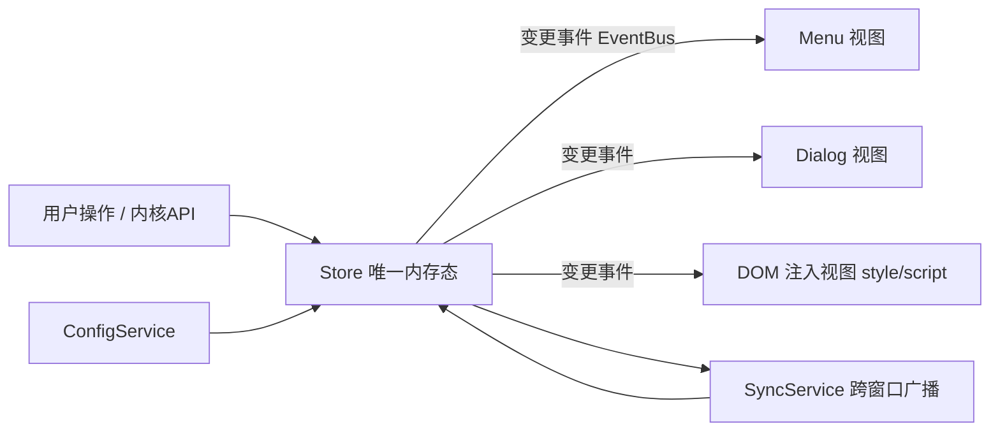

# snippets 插件架构重构设计

> 目标：把 `src/index.ts` 中 ~6200 行的"上帝类"解耦为职责分明的模块化结构。
> 原则：**不破坏现有运行行为**，通过单向数据流 + 内部事件 + 分视图封装，把"本地操作"与"跨窗口同步"合并为同一条代码路径。
> 状态：设计稿（分析阶段产物），尚未改动运行代码。迁移请按「阶段」逐步进行、每步可验证。

---

## 0. 会话进度与协作要求（续接用）

> 本会话（2026-09-04）实际执行记录。此后新会话请先读此节与仓库记忆 `/memories/repo/snippets-plugin.md`，再继续重构。

### 协作方式（用户的硬性要求）
- **小步推进**：一次只改一小块、行为等价；改完展示给用户，**用户明确确认后才 `git commit`**；再继续下一块。
- **方向由 AI 自主挑**，用户只判断"每批对不对"，不要反复让用户做方向决策。
- **提交前必须等用户确认**，不得擅自提交；每批单独一次 commit。
- **对齐思源原生实现 / 优先用官方 API**：凡思源已提供 API 的就用 API，不自造重复实现；需对照思源源码（`d:\CodeProjects\siyuan` 已加入工作区）核对。

### 已完成提交（main，自下而上）
| commit | 内容 |
|---|---|
| `ff0a40f` | fix: 跨窗口删除后菜单计数顺序 bug（`deleteSnippetSync` 计数在列表 filter 后才刷新） |
| `40b86f1` | refactor: 抽取 `moveElementToTop` 到 `utils.ts` |
| `594e7da` | refactor: 接入 `event-bus`——删除片段经 `SNIPPETS_CHANGED` 事件刷新菜单计数，禁用时 `internalEventBus.clear()` |
| `59c4a54` | feat: 新增 `core/event-bus.ts` 类型化事件总线（on/off/emit/clear） |
| `90c542d` | refactor: 移除 storage 抽取后残留的未使用私有 `getFile` |
| `4a1df23` | refactor: 导出代码片段重命名去除随机前缀（`exportSnippetsToFile` + `storage.renameFile`） |
| `fe010b4` | refactor: 抽取 `getFile`/`putFile` 到 `services/storage.ts` |
| `7fcbc69` | refactor: jcsm `snippetsType`/`defaultSnippetsType` 收紧为 `SnippetType` |
| `3d12228` | refactor: 新增 `SnippetType` 并收紧 `isSnippetsTypeEnabled` 及调用链 |
| `7441f3e` | refactor: 抽取 `htmlToElement` 到 `utils.ts` |
| `49ec2aa` | refactor: 改用 `platformUtils.updateHotkeyTip`，移除自写 isMac/getHotkeyDisplayText |
| `dd296e9` | refactor: 抽取纯工具函数到 `utils.ts` |
| `4f2773e` | refactor: 抽取 `isValidJavaScriptCode` 到 `domain/snippet.ts` |

当前工作区：仅 `docs/`（本文档）未跟踪；`index.ts` 已随各批提交、处于干净状态。

### 已建模块
- `src/core/event-bus.ts`（类型化 pub/sub，`on/off/emit/clear`；注意：勿用字段名 `eventBus`，会与 siyuan `Plugin` 基类成员冲突，内部用 `internalEventBus`）
- `src/services/storage.ts`（`getFile`/`putFile`/`renameFile`）
- `src/utils.ts`（含 `isPromiseFulfilled`/`hideTooltip`/`showElementTooltip`/`isInputElementActive`/`htmlToElement`/`moveElementToTop`）
- `src/domain/snippet.ts`（`isValidJavaScriptCode`/`isSnippetsTypeEnabled`）
- `types.d.ts` 新增导出 `SnippetType = "css" | "js"`

### 事件化模式（已建立，尚处 1:1 阶段）
- 事件名常量 `SNIPPETS_CHANGED`（index.ts）；订阅刷新菜单计数；delete 本地(`deleteSnippet`)与 sync(`deleteSnippetSync`) 两条路径均已 emit。
- **注意**：不要为了"为模式而模式"把顺序正确、意图清晰的直接 `setMenuSnippetCount()` 改 emit——单个正确直接调用无需改；真正消去这些调用要等 Store 统一（见阶段 2/3），届时再集中收敛。
- 已知未处理：`saveSnippet`/`saveSnippetSync` 里 4 处"新增/复制后 `setMenuSnippetCount()`"文本高度对称、顺序均正确，留待 Store 批次统一（文本歧义高，不宜逐点硬改）。

### 已报告 issue
- siyuan-note/siyuan **#19130**：文件写入类 API（putFile/removeFile/renameFile/copyFile）对不参与同步的目录（如 `temp/`）也会 `IncSync()`；并补充 comment 说明 `data/.siyuan/syncignore` 忽略的路径同理。

### 用户疑问已澄清（导出文件名带 hex 前缀）
- 前缀是思源内核 `exportResources`/`ExportResources` 为隔离/令牌下载故意加的随机 exportID（`kernel/model/export.go`），非 bug；思源原生导出不走该接口故不带。
- 已通过 `renameFile` 把导出产物在 `temp/export` 内改名为干净名后 `saveExportFile`（zip 结构不变，新旧版本导入兼容）。跨平台可用性已核实（桌面 copy / 移动端+浏览器 均解析同一 `/export/` 实体 `temp/export`）。

### 下一步建议（朝目标架构，拆可验证子批推进）
1. 建 `core/state.ts` + `domain/snippet-store.ts`（阶段 2）：把 snippetsList 增/删/改收敛为单一 `apply` 并统一发 `SNIPPETS_CHANGED`，让 `saveSnippet`/`saveSnippetSync`/`deleteSnippet(Sync)`/`toggleSnippet(Sync)`/排序等散落写点逐步改走 store。
2. 阶段 3：`services/sync.ts` 类型化广播协议并让远程消息映射到 store `apply`，消除 `*Sync` 镜像。
3. 之后：config 声明式（阶段 4）、UI 视图化（阶段 5）、jcsm 收敛（阶段 6）。

---

## 1. 现状：问题诊断

`src/index.ts` 单个 `PluginSnippets` 类（约 6200 行）承担至少 11 类职责，行号分布见下表（以 2026-09 版为准，后续代码变动请重新核对）。

| 行段 | 职责 |
|---|---|
| 75–285 | 生命周期 / 顶栏 / 命令 / 图标 |
| 285–1148 | 设置系统（configItems + defineProperty + applySetting 大 switch） |
| 1149–2647 | 顶栏菜单 UI + 事件委托 + 拖拽排序 + 搜索 + 呼吸动画 |
| 2648–3188 | 片段 CRUD / 数据层 / `updateSnippetElement` |
| 3189–4165 | 编辑对话框 + CodeMirror 编辑器 + 主题监听 |
| 4166–4366 | 通知 / 错误 / 日志队列 / 文件读写 |
| 4367–4716 | 通用工具 / reloadUI / 快捷键 / tooltip / console |
| 4717–4945 | 手搓监听器管理 |
| 4946–5581 | 文件监听 |
| 5582–5989 | 导入导出 + 备份 |
| 5990–6261 | 跨窗口广播 / WebSocket |

`utils.ts` 仅 19 行、`types.d.ts` 128 行，几乎无下沉拆分。

### 六类核心耦合

1. **状态散落三处互相镜像**
   同一份片段/配置同时存在于：SiYuan 内核（`/api/snippet/*`）、`window.siyuan.jcsm` 全局、实例字段（`defineProperty` 代理 jcsm）。jcsm 同时充当「跨 reload 存活」「跨窗口共享」「运行态句柄（监听器数组 / 文件监听 Map / observer）」三类存储。

2. **每个写操作重复三份**
   `toggleSnippet / saveSnippet / deleteSnippet`（本地改 state + 刷 DOM + broadcast）与各自的 `*Sync` 镜像（再改一遍 state + DOM）几乎相同，只是来源不同。UI 更新被拆到菜单项 / head 元素 / Dialog 三套 DOM，极易不同步。

3. **视图 = HTML 字符串 + querySelector 神句**
   菜单、对话框手拼 HTML + `data-*` + 事件委托；业务逻辑与 DOM 结构深度绑定，改一处 DOM 会在散落各处的长选择器里崩。

4. **手搓响应式设置系统**
   一个设置要登记 `configItems`、defineProperty、getter/setter、`applySetting` switch、`applySettingSync`、jcsm 类型——约 7 处，新增成本高、易漏。

5. **服务层缺失**
   网络、文件读写、日志、广播、通知全是 `this.xxx` 私有方法，无法复用/独立验证。

6. **类型安全薄弱**
   `data: any`、`jcsm as any` 遍布；广播协议无类型；本地/远程 handler 签名不一致。

---

## 2. 目标架构：单向数据流 + 事件订阅 + 分模块

**核心转变**：从「mutator 手动四处刷 DOM + 广播」改为
**store 变更 → 发内部事件 → 各 UI 视图订阅并自行重渲染 → sync 层统一对外广播**。
`toggleSnippet` 与 `toggleSnippetSync` 的重复逻辑收敛为 store 的 `apply()` 与一个订阅者。



### 目录规划

```
src/
  index.ts              # 薄入口：装配并启动
  plugin.ts             # PluginSnippets 外壳（瘦身后，只剩生命周期编排 + 委托）
  core/
    event-bus.ts        # 类型化发布订阅（emit/on/off）
    state.ts            # 运行时内存态仓库：snippetsList / ui / config 快照 + 变更通知
    config/
      schema.ts         # 声明式配置项（一份定义 → getter/setter/设置UI/apply 回调自动派生）
      config-service.ts # 加载/持久化/版本迁移/defineProperty
  domain/
    snippet.ts          # Snippet 实体 + JS 有效性校验(acorn) + ID 生成 + 类型/发布判断
    snippet-store.ts    # 内核 CRUD + 本地缓存 + 变更事件（单一写路径）
  services/
    api.ts              # fetchPost/fetchSyncPost 封装（类型化响应）
    storage.ts          # getFile/putFile/removeData/loadData
    notification.ts     # showNotification/showErrorMessage/disableNotification
    log.ts              # 队列化日志写入
    hotkey.ts           # getCustomKeymapByCommand/getHotkeyDisplayText
    listener-manager.ts # 复用现有监听器管理（纯抽出）
    file-watch.ts       # 文件监听服务
    sync.ts             # 跨窗口广播/WebSocket：协议类型化 + 消息分发
    import-export.ts    # 导入/导出/备份/JSON 校验
  ui/
    top-bar.ts
    menu/{menu,menu-item,drag-sort,search,tooltip}.ts
    dialog/{setting-dialog,snippet-edit-dialog,confirm}.ts
    editor/code-mirror.ts  # 创建 EditorView / extensions / 主题监听
  i18n/  types.d.ts  utils.ts
```

### 关键设计点

- **唯一写路径**：所有对 snippet 数据/配置的变更都进入 store 或 config-service 的 `set`，由其触发统一事件，任何 UI/同步方只需订阅，不再自己改 state + 自己刷多处 DOM。
- **收敛 jcsm**：把三种用途分开——
  - *持久配置*：落盘，由 `ConfigService` 读写；
  - *跨 reload 存活性句柄*：仅保留少数必须存活引用（已打开 Dialog / CodeMirror 实例）；
  - *跨窗口同步*：一律走 `sync.ts` 的消息协议，不再把状态塞进 jcsm 当"共享变量"。
- **广播协议类型化**：定义消息联合类型，`handleBroadcastMessage` 的 switch 由 `sync.ts` 收敛；远程事件与本地变更统一映射到同一个 store `apply`，从根上消灭 `*Sync` 镜像代码。
- **设置声明式**：`schema.ts` 里一份配置项（key / 类型 / 默认 / 选项 / `onApply` 回调），自动派生设置对话框控件、defineProperty、持久化、变更处理；删除 `applySetting` 大 switch。
- **UI 按视图封装**：每个视图自己持有 DOM 构建与更新逻辑，从 store 拉取数据渲染；不同视图之间不再通过 querySelector 互戳。

---

## 3. 迁移路线图（渐进、每步可验证）

> 推荐**渐进式**：任何一步跑完 `tsc --noEmit` + `eslint .` + `pnpm run dev` 热重载验证通过后再进下一步。**避免一次性整体重写**（无测试、风险高）。

### 阶段 0：安全网
- 现有代码 git 提交或备份 `index.js` / `dist`。
- 确认 `pnpm run dev`（watch）与 `pnpm run build` 基线可用。

### 阶段 1：只抽不改——纯逻辑/服务下沉
- 把无 UI 依赖的片段先抽出：`api.ts`（fetch 封装）、`storage.ts`、`log.ts`（日志队列）、`snippet.ts`（实体 + acorn 校验 + ID 生成）、`listener-manager.ts`。
- 每个抽出的模块保持"纯函数/类，不依赖插件实例状态"，类内方法改为调用模块，行为等价。
- **验证**：编译 + 热重载 + 手动回归对应功能。

### 阶段 2：引入内部事件总线 + Store（不动 UI）
- 新增 `core/event-bus.ts` 与 `core/state.ts`。
- 让 snippet 的 CRUD 改走 store 的单一 `set/apply`，store 变更发事件；类内仍保留旧 DOM 修补作为"订阅者"接入事件，行为不变，但已消除"本地/远程两份"差异的准备。
- 这一步是**结构安全网**，把散落的修改点收敛到事件源。

### 阶段 3：跨窗口 sync 收敛
- `sync.ts`：类型化消息协议 + 消息分发；远程消息直接映射到 store 的 `apply`，删除全部 `*Sync` 镜像方法及其在 `handleBroadcastMessage` 的分支重复。
- **验证**：多窗口增删改/开关一致。

### 阶段 4：设置系统改造
- 引入 `config/schema.ts` 声明式配置；自动派生 defineProperty/设置控件/持久化。
- 把 `applySetting` 大 switch 逐 key 改为每个配置项的 `onApply` 回调（回调内部仍走 UI 视图方法而非散落 DOM）。
- **验证**：逐项设置保存/重载/跨窗口一致。

### 阶段 5：UI 视图模块化（收尾，工作量最大）
- 把 `menu / dialog / editor / top-bar` 逐步抽成独立视图类，各自订阅 store 重渲染，删除跨视图 DOM 直戳。
- 按视图拆分后可引入更细粒度（drag-sort、search、tooltip）模块。
- **验证**：逐视图回归（菜单开关/拖拽/搜索、编辑对话框实时预览、文件监听导入）。

### 阶段 6：jcsm 收敛与瘦身外壳
- `plugin.ts` 只留生命周期编排与对外委托；jcsm 仅保留必需的 reload 存活句柄与持久配置出口。
- 收尾清理：移除 `*Sync` 残留、`data: any` 尽可能类型化。

---

## 4. 风险与应对

| 风险 | 应对 |
|---|---|
| 无测试、一次重写易引入回归 | 走渐进式 + 每阶段人工回归清单；阶段 2/3 的 store+订阅先做结构等价替换 |
| 跨窗口实时同步易不一致 | 阶段 3 才改 sync，且以"本地/远程同走 store apply"为目标 |
| 实时预览 / reload 存活性依赖 jcsm 旧引用 | 阶段 6 再做 jcsm 收敛，之前保持句柄语义 |
| acorn 校验 / CodeMirror 主题等边缘逻辑改动 | 抽出时保持纯函数，行为逐字对齐，靠 git diff 核对 |

---

## 5. 人工回归清单（各阶段通用）
- [ ] 顶栏按钮打开菜单 / 关闭
- [ ] 片段开关注册到内核并实时生效（CSS/JS）
- [ ] 发布服务开关（含 publish 窗口差异）
- [ ] 全局启停 + 类型切换 + 呼吸提示
- [ ] 拖拽排序持久化
- [ ] 新建/编辑/复制/删除片段；JS 无效代码拦截
- [ ] CodeMirror：语法高亮、缩进单位、主题随系统亮暗切换、实时预览
- [ ] 设置每一项保存→重载→跨窗口生效
- [ ] 文件监听（启用/路径/间隔变更、增量检测）
- [ ] 导入（追加/覆盖/重复 ID）/ 导出 / 备份
- [ ] 多窗口增删改一致；reload 后旧 Dialog 状态不丢
- [ ] `tsc --noEmit` + `eslint .` 干净；`pnpm run build` 产出 `dist/package.zip`
