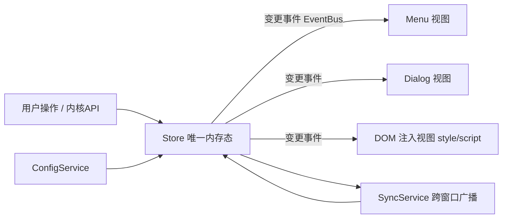

# snippets 插件架构重构设计

> 目标：把 `src/index.ts` 中 ~6200 行的"上帝类"解耦为职责分明的模块化结构。
> 原则：**不破坏现有运行行为**，通过单向数据流 + 内部事件 + 分视图封装，把"本地操作"与"跨窗口同步"合并为同一条代码路径。
> 状态：设计稿（分析阶段产物），尚未改动运行代码。迁移请按「阶段」逐步进行、每步可验证。

---

## 0. 会话进度与协作要求（续接用）

> 本会话（2026-09-04）实际执行记录。此后新会话请先读此节与仓库记忆 `/memories/repo/snippets-plugin.md`，再继续重构。

### 协作方式（用户的硬性要求）
- **小步推进**：一次只改一小块、行为等价；改完展示给用户，**用户明确确认后才 `git commit`**；再继续下一块。
- **提交必须由用户明确放行**：任何代码/文档改动完成后都**不得擅自提交**——先把改动与摘要展示给用户检查，用户说"继续/提交"后才 `git commit`（2026-09-04 用户追加强调："必须要我让你继续进行下一步，才提交代码，因为我要先检查"）。"让继续下一步"与"可以提交本批"视同放行。
- **"继续"= 提交本批后再直接推进下一轮**（2026-09-04 用户再次明确）：用户说"继续"时，应先提交当前已展示批次的改动（代码与 docs 各自独立 commit），随后**不必再次停下询问，直接开始并完成下一轮小步改动**，改完再展示摘要等下一次"继续"；仅在方向分歧或需用户拍板的决策点才停下询问。
- **方向由 AI 自主挑**，用户只判断"每批对不对"，不要反复让用户做方向决策。
- **对齐思源原生实现 / 优先用官方 API**：凡思源已提供 API 的就用 API，不自造重复实现；需对照思源源码（`d:\CodeProjects\siyuan` 已加入工作区）核对。- **以最新思源代码为基准**（2026-09-04 用户明确）：插件重构始终以最新思源代码为基准，不保留面向旧内核/旧 API 的兼容路径；需据此判断与思源同步演进中的功能取舍。
### 已完成提交（main，最新在上）
| commit | 内容 |
|---|---|
| `b415de3` | refactor: 配置装配/持久化/热应用外迁至 src/config/config-service.ts |
| `abaf6a1` | refactor: 设置对话框装配与交互外迁至 src/ui/setting-dialog.ts |
| `b16639e` | refactor: applySetting 大 switch 全部迁入 configItems.onApply 后删除 |
| `fdbc2ef` | refactor: 编辑器生命周期管理（主题监听/更新/重建）外迁至 src/ui/editor-manager.ts |
| `56f5073` | docs: 记录 setting_apply 退役收口 onDataChanged、schema/codemirror 拆分与最新思源基准原则 |
| `98a84d6` | refactor: 退役 setting_apply 广播，配置跨窗口同步收口内核 onDataChanged |
| `df4ff9c` | refactor: CodeMirror 编辑器工厂外迁至 src/ui/codemirror.ts |
| `acb64cb` | refactor: configItems 类型与条目定义外迁至 src/config/schema.ts |
| `c276e04` | refactor: applySetting 改查 configItems.onApply 分发，三个按钮显隐项迁入声明 |
| `cb25da5` | docs: 明确继续指令即提交本批并直接推进下一轮 |
| `57313b1` | refactor: saveSnippet 本窗口/同内核前端 origin 合流，删除 saveSnippetSync 镜像 |
| `a0e9f11` | docs: 记录 toggleSnippetPublish 合流与 isPublish 语义澄清 |
| `633801c` | refactor: toggleSnippetPublish 本窗口/同内核前端 origin 合流并修复 isPublish 语义 |
| `2624c32` | docs: 记录 globalToggle/delete origin 合流进度 |
| `25ddd38` | refactor: globalToggle/delete 本地远程 origin 合流，删除两个 Sync 镜像 |
| `21ae512` | docs: 记录 jcsm 现状与死声明清理，阶段 3 壳方法清空进度 |
| `5a93fb7` | refactor: 清理 jcsm 死类型声明与 3 个薄壳 Sync 方法 |
| `fbd8a02` | docs: 明确提交须用户放行；记录 sync 分发注册表与 toggle 合并 |
| `58429a7` | refactor: sync 业务分发改注册表，toggle 开关本地/远程合流 |
| `aa585f6` | refactor: 广播通道收敛为 BroadcastService，发送接收两侧类型化 |
| `f0ef773` | feat: 新增 services/sync 广播协议类型并收紧 handler 参数类型（阶段 3） |
| `442c9e6` | docs: 同步退出预览去原文化完成状态 |
| `2a2b0f9` | feat: snippet_element_update 退出预览去原文化，接收窗口自拉恢复 |
| `a6984c8` | docs: 修正同内核多实例即时同步机制结论，记录 CSS 实时预览原文豁免决策 |
| `985cd61` | feat: snippet_save 广播去原文化，接收窗口自拉权威数据 |
| `b7718de` | docs: 记录广播协议禁传 snippet 原文的约束 |
| `a60214f` | feat: SnippetStore 支持整表替换，清理两处漏网列表写点 |
| `bcd8a2c` | feat: SnippetStore 支持拖拽排序移动，executeDragSort 改走统一写路径 |
| `3de8cf0` | feat: SnippetStore 支持锚点插入，复制分支改走统一写路径 |
| `ed90857` | feat: saveSnippet 新增/更新改走 SnippetStore 统一写路径 |
| `df49c78` | feat: SnippetStore 支持新增/更新，saveSnippetSync 改走统一写路径 |
| `5cc6361` | feat: 覆盖 onDataChanged 热应用同步配置，避免整插件 reload |
| `4da4ee2` | feat: 新增 SnippetStore 统一代码片段列表删除写路径 |
| `bfb351c` | docs: 记录架构重构设计及会话进度 |
| `ff0a40f` | fix: 跨窗口删除后菜单计数顺序 bug（`deleteSnippetSync` 计数在列表 filter 后才刷新） |
| `40b86f1` | refactor: 抽取 `moveElementToTop` 到 `utils.ts` |
| `594e7da` | refactor: 接入 `event-bus`——删除片段经 `SNIPPETS_CHANGED` 事件刷新菜单计数，禁用时 `internalEventBus.clear()` |
| `59c4a54` | feat: 新增 `core/event-bus.ts` 类型化事件总线（on/off/emit/clear） |
| `90c542d` | refactor: 移除 storage 抽取后残留的未使用私有 `getFile` |
| `4a1df23` | refactor: 导出代码片段重命名去除随机前缀（`exportSnippetsToFile` + `storage.renameFile`） |
| `fe010b4` | refactor: 抽取 `getFile`/`putFile` 到 `services/storage.ts` |
| `7fcbc69` | refactor: jcsm `snippetsType`/`defaultSnippetsType` 收紧为 `SnippetType` |
| `3d12228` | refactor: 新增 `SnippetType` 并收紧 `isSnippetsTypeEnabled` 及调用链 |
| `7441f3e` | refactor: 抽取 `htmlToElement` 到 `utils.ts` |
| `49ec2aa` | refactor: 改用 `platformUtils.updateHotkeyTip`，移除自写 isMac/getHotkeyDisplayText |
| `dd296e9` | refactor: 抽取纯工具函数到 `utils.ts` |
| `4f2773e` | refactor: 抽取 `isValidJavaScriptCode` 到 `domain/snippet.ts` |

当前工作区：**干净**（b415de3 已提交；阶段 3 收官，阶段 4 进行中：configItems 条目外迁 schema.ts 且全部 UI 副作用迁入 onApply（applySetting 大 switch 已删除，b16639e）、CodeMirror 工厂外迁 codemirror.ts、编辑器生命周期管理外迁 editor-manager.ts、设置对话框装配/交互外迁 setting-dialog.ts、配置装配/持久化/热应用外迁 config-service.ts、setting_apply 退役收口内核推送，见下方「下一步建议」）。

### 已建模块
- `src/core/event-bus.ts`（类型化 pub/sub，`on/off/emit/clear`；注意：勿用字段名 `eventBus`，会与 siyuan `Plugin` 基类成员冲突，内部用 `internalEventBus`）
- `src/services/storage.ts`（`getFile`/`putFile`/`renameFile`）
- `src/services/sync.ts`（阶段 3：协议类型 + 传输 + 分发。协议：payload 接口 + `SnippetBroadcastBody`（消息体）→ `WithEnvelope` 分配式生成 `SnippetBroadcastMessage`（信封 + 消息体），`SnippetBusinessMessage` 为去掉窗口保活后的业务子集；含禁原文约束与 CSS 预览豁免注释。传输与分发：`BroadcastService` 统一管理 windowId/其他窗口在线集合/WebSocket 连接与自动重连/页面卸载通知，内部消化窗口保活三消息；`broadcast<T extends SnippetBroadcastBody>` 类型化发送（信封由服务保证附加）；业务消息按 type 查表分发到构造入参 `handlers: Partial<BroadcastHandlers>`（各键处理器直接拿到收窄后的 payload），未注册 type 仅告警；日志经 `BroadcastLogger` 注入）
- `src/config/schema.ts`（阶段 4：`SnippetsConfigItem`/`SnippetsConfigOption` 类型与 `createSnippetsConfigItems(ctx)` 条目构建；ctx 为 `SnippetsConfigContext` 读取器/动作函数集（isMobile()/i18n()/menuItems()/menuOpen()/menuSnippetsItemsHtml()/updateAllEditorConfigs()/removeTopBarElement()/initTopBar()/setMenuPosition()/startFileWatch()/stopFileWatch()/handleFileWatchPathChange()/handleFileWatchIntervalChange()），条目构建时的静态值（ignore/description 等）在构建时刻求值，条目内箭头函数体（createActionElement/onApply）中的读取器/动作在调用时才执行，保证运行态实时、规避 no-this-alias）
- `src/ui/codemirror.ts`（阶段 4：纯编辑器工厂 `getEditorIndentUnit`/`createEditorExtensions`/`createCodeMirrorEditor`，参数化 indentUnitConfig/i18n；`SnippetsEditorI18n = Record<string, string>` 兼容插件 i18n 类型）
- `src/ui/editor-manager.ts`（阶段 4：`EditorManager` 类——主题模式监听启停/检查（observer 挂 window.siyuan.jcsm）、已打开对话框编辑器更新 `updateAllEditorConfigs`/重建 `recreateEditor`；运行态经 `EditorManagerHost` 读取器注入；`onunload`/`uninstall` 的清理由 `stopThemeModeWatch()` 收敛，消除重复）
- `src/ui/setting-dialog.ts`（阶段 4：`SettingDialog` 类 + `SettingDialogHost` 读取器/动作注入——原 `openSetting` 方法整体外迁（对话框装配/设置项渲染/点击与全局按键/滚轮/touchmove 监听/原生设置跳转两段异步重试）；`openSettingTab` 辅助与 `SETTING_TAB_MOUNT_MAX_RETRIES` 常量随迁为模块级；index.ts 侧 `openSetting` 收口为 `this.settingDialog.open()` 委托）
- `src/config/config-service.ts`（阶段 4：`ConfigService` 类 + `ConfigServiceHost` 注入——原 `initSetting`+`loadConfig`（读取/版本校验/写默认值/defineProperty 挂实例属性/装配 Setting）收编为 `init()`，`saveSetting` 收编为 `saveFromDialog()`，`applyConfig`/`onDataChanged` 方法体收编为 `applyConfig`/`reloadFromStorage()`，`disableNotification` 随迁；私有收口 `persistConfig`/`createSettingItem`（含 isPromiseFulfilled 语义原样保留）；存储键名与生命周期数据方法由 index 闭包转发，service 不感知具体键；index.ts 侧 `onDataChanged` 收口为 `configService.reloadFromStorage()`，`onLayoutReady` 改 `configService.init()` 后 `setting = configService.setting!`）
- `src/utils.ts`（含 `isPromiseFulfilled`/`hideTooltip`/`showElementTooltip`/`isInputElementActive`/`htmlToElement`/`moveElementToTop`）
- `src/domain/snippet.ts`（`isValidJavaScriptCode`/`isSnippetsTypeEnabled`）
- `src/domain/snippet-store.ts`（`SnippetStore`：`remove`/`upsert`/`insertBefore`/`move`/`replaceAll`，单一写路径 + 统一发 `SNIPPETS_CHANGED`）
- `types.d.ts` 新增导出 `SnippetType = "css" | "js"`

### 事件化模式（已建立）
- 事件名常量 `SNIPPETS_CHANGED`（现位于 `domain/snippet-store.ts`）；订阅刷新菜单计数。
- 已收敛：片段列表的增/删/改/复制/拖拽排序/整表替换（导入）均改走 `SnippetStore`（`upsert`/`remove`/`insertBefore`/`move`/`replaceAll`），写后统一 emit；`saveSnippet`/`saveSnippetSync` 内手写列表修改与 `setMenuSnippetCount()` 已随各批移除，计数刷新完全由事件驱动。
- 已知未收敛（语义非本地结构写，留待 sync/后续阶段）：`openMenu`/`getSnippetById`/`executeDragSort` 前置、`saveSnippetSync` 复制分支等处“从服务端全量重拉列表”的赋值属读取权威态语义；toggle 类就地字段修改不改变列表结构。

### jcsm 现状与已做收敛（2026-09-04 用户追问后核实）
- `window.siyuan.jcsm` 唯一职责 = **跨插件 reload 存活**的全局变量仓库（reload：插件更新 / 手动重载；`onDataChanged` 已热应用不再触发 reload）。
- 三类存储：① 配置镜像（configItems → `loadConfig` 写入 + `Object.defineProperty(this, key)` 代理到 `(jcsm as any)[key]`：realTimePreview/newSnippetEnabled/consoleDebug/snippetSearchType/fileWatch*/defaultSnippetsType…）；② 运行态句柄（手写 getter/setter 读写 jcsm：isMobile/snippetsType/snippetsList/listeners/listenerCheckIntervalId/isCheckingListeners/isReloadUIRequired/themeObserver/disableNotification）；③ 已死残留（类型声明无任何类型化读写）。
- **已做（已提交，5a93fb7）**：`types.d.ts` 的 jcsm 块删除 11 个死声明（realTimePreview/newSnippetEnabled/consoleDebug/notificationSwitch/reloadUIAfterModifyJS/snippetSearchType/fileWatchEnabled/Path/Interval/IntervalId/FileStates——运行时仅经 `(jcsm as any)` 或实例字段访问），仅保留仍被类型化读写的 11 项并加说明注释。
- **整体拆除留待阶段 6**：需先有 ConfigService（阶段 4）与视图自持运行态（阶段 5）作替代承载；届时 jcsm 仅保留真正必须跨 reload 存活的少数句柄。

### 已报告 issue
- siyuan-note/siyuan **#19130**：文件写入类 API（putFile/removeFile/renameFile/copyFile）对不参与同步的目录（如 `temp/`）也会 `IncSync()`；并补充 comment 说明 `data/.siyuan/syncignore` 忽略的路径同理。

### 用户疑问已澄清（导出文件名带 hex 前缀）
- 前缀是思源内核 `exportResources`/`ExportResources` 为隔离/令牌下载故意加的随机 exportID（`kernel/model/export.go`），非 bug；思源原生导出不走该接口故不带。
- 已通过 `renameFile` 把导出产物在 `temp/export` 内改名为干净名后 `saveExportFile`（zip 结构不变，新旧版本导入兼容）。跨平台可用性已核实（桌面 copy / 移动端+浏览器 均解析同一 `/export/` 实体 `temp/export`）。

### 思源内核自动同步机制与广播取舍（2026-09-04 源码实证，二次修正）
背景：这里说的“跨窗口”是**同一内核的不同前端实例**（多 Electron 窗口 / 浏览器标签页 / 移动端均连同一内核 WebSocket），与跨设备云/LAN 同步是两回事。
用户观察：思源本身修改代码片段后会自行同步到其他前端实例。源码核实：**正确，且即时**——因为思源原生保存流程总是**成对调用**两个 API：
1. `/api/snippet/setSnippet`（写 `data/snippets/conf.json`，本身**不广播**，见 `kernel/api/snippet.go`）；
2. `/api/setting/setSnippet`（`setConfSnippet`，更新全局 enabledCSS/enabledJS）→ `PushReloadSnippet` → `BroadcastByType("main", "setSnippet")`（`kernel/api/setting.go`）。
`BroadcastByType` 遍历同内核**所有实例**的 main WebSocket 会话**进程内即时写入**（`kernel/util/websocket.go`），与是否启用云/LAN 同步无关。各实例收到 `setSnippet` 后置 `config.snippet` 并 `renderSnippet()` 全量重拉重注入（桌面 `app/src/index.ts`、移动 `mobile/util/onMessage.ts`、独立窗 `window/index.ts` 均有该 case）。

**内核 repo 合并路径（`repository.go` `processSyncMergeResult` → `PushReloadSnippet`）是另一回事**：那是**跨设备**场景——其他设备写的 conf.json 经数据同步拉回本机后，通知本机所有实例刷新。**不是**同内核多实例即时同步的前提。

**对插件的影响（关键）**：插件自己的写库（保存/删除/开关/排序，均只调 `/api/snippet/setSnippet`，不伴随 `/api/setting/setSnippet`）**不会**触发内核广播，因此插件**仍必须**用自定义广播来即时同步其他插件实例（这点此前结论有误，已撤销“可删”建议）。例外：插件全局开关 `globalToggleSnippet` 走 `/api/setting/setSnippet` → 内核即时广播 setSnippet → 其他实例原生 `renderSnippet` 全量重渲染注入元素（会覆盖“已保存片段”的注入）；但插件 Sync 仍需处理“正在实时预览的片段保护”与“其他窗口菜单开关 UI 刷新”，故 `snippet_toggle_global` 不能整删、只可后续精简。
- 插件写入 `/data/storage/petal/<name>/`（插件配置）不参与上述任何广播：本地写只在本实例生效；跨设备云同步合并时才走 `dataChangePlugins`（需插件覆盖 `onDataChanged`，已实现）。

**广播消息取舍清单（据此阶段 3 sync 收敛）**：
| 消息 | 现状 | 建议 |
|---|---|---|
| `snippet_save` / `snippet_delete` / `snippet_toggle` / `snippet_toggle_publish` / `snippets_sort` | 已保存内容/开关/排序 | **保留**：插件写库只调 snippet API、内核不广播，需自定义广播同步其他插件实例；已去原文化（只发元数据 + ID） |
| `snippet_toggle_global` | 全局开关 | **保留（可精简）**：`/api/setting/setSnippet` 已即时广播使其他实例原生全量重渲染；Sync 仅保留“预览片段保护”与“菜单开关刷新” |
| `snippet_element_update` / `snippet_element_remove`（预览态） | 实时预览/退出预览 | **保留**：临时内容未保存，内核无法同步，这是插件唯一必须自理的跨窗口状态；`previewState: true` 预览豁免原文，`previewState: false` 退出预览已去原文化（自拉已保存片段恢复） |
| ~~`setting_apply`~~ | ~~插件配置~~ | **已退役（98a84d6）**：原结论“petal 配置本地写不跨窗口、内核不广播”在思源 2a11f8ab（#19132）起不再成立——文件接口写入会按发起实例 app 排除自身后推送其他实例（reason=overwrite），配置跨窗口同步收口到 `onDataChanged`（详见下方「插件配置跨窗口同步收口（2026-09-04）」节） |
| `window_online` / `window_offline` / `window_online_feedback` | 窗口保活发现 | 保留（消息广播前需确认有其他窗口在线） |

**已决问题**：
1. ~~是否确认删除“可删”消息~~（已撤销：同内核多实例下插件写库不经内核广播，插件广播不能删）。
2. **CSS 实时预览放行原文（2026-09-04 用户拍板，方案 a）**：编辑中的 CSS 实时预览（`previewState: true`）广播豁免“禁原文”，允许携带编辑中的 CSS 文本——预览内容未保存、接收窗口无法自拉，且预览由本窗口显式操作触发、受众是同内核可信实例。豁免范围严格限定：仅 CSS 编辑中预览；**退出预览**（`previewState: false`）恢复用的是已保存片段，已去原文化（接收窗口自拉）。

### 发布服务 isPublish 语义澄清（2026-09-04 双窗口实测 + 思源源码核对）
- 实测暴露一个**既有 bug**：拨 A 窗口的发布开关，B 窗口菜单开关不同步（重开菜单才对）。根因：`isPublish()` 原实现读 `window.siyuan.config.publish.enable`（“内核是否启用发布服务”），导致只要内核开了发布服务，所有普通窗口都会误入 issue #33 预留的“维护发布注入元素”分支（不碰菜单 checkbox，且 `enabled=false` 时误删注入元素 / `store.remove`）。已修复：`isPublish()` 改为 `window.siyuan.isPublish`（**当前会话是否为发布站点**，由内核按会话角色注入：`kernel/util/websocket.go` 发布会话 + `kernel/api/system.go`；普通编辑前端恒 false）。同时修复接收分支 `checkbox.checked = !enabled`（菜单 publishSwitch 显示语义为 `checked = !disabledInPublish`，而载荷 enabled 即 disabledInPublish）。
- **两个不同概念**：`config.publish.enable` = 内核是否启用发布服务（编辑端 UI 是否显示发布开关行 / 该显示逻辑 `isShowPublishCheckbox` 用它正确）；`window.siyuan.isPublish` = 当前会话是否发布站点。
- **插件在发布站点的差异（源码实证）**：发布站点会话被内核标为只读角色（`kernel/model/role.go` `IsReadOnlyRole`：读者/访客），写 API 全被拒；插件能否加载取决于 manifest `disabledInPublish`（`kernel/model/plugin.go` `isPetalAccessableInPublish`）——**本插件 manifest 即 `"disabledInPublish": true`，发布站点不加载**（issue #33 因此现状不可达）；`disabledInPublish` 的真正消费方是思源发布系统——原生片段设置里该行仅在 `config.publish.enable` 时显示（`app/src/config/util/snippets.ts`），内核 `/api/snippet/getSnippet` 在只读上下文自动跳过 `DisabledInPublish` 片段（`kernel/api/snippet.go`），即“编辑端拨开关只是记元数据，发布端生成内容时消费”。

### 插件配置跨窗口同步收口（2026-09-04，思源 2a11f8ab / siyuan#19132）
- 思源 2a11f8ab 起：前端插件基类 `onDataChanged(reason?: TPluginDataChangeReason)`（`"sync" | "overwrite"`，petal 类型同步于 f3f8988）；任意实例经文件接口（putFile/removeFile，带发起实例随机 `Constants.SIYUAN_APPID`）写入 `data/storage/petal/<插件>/` 时，内核 `PushPluginStorageDataChanged` 按发起实例 app 排除其自身后，向其余实例推送 `reloadPlugin(dataChangePlugins + reason="overwrite")`；跨设备仓库合并推送 reason=`"sync"`（`repository.go`）。判定未变：未覆盖基类 `onDataChanged` 的插件仍整插件 reload（`loader.ts shouldReloadOnDataChange`）。
- **snippets 处置（98a84d6）**：覆盖 `onDataChanged` 必须保留（本插件保存/同步配置即触发数据变更，不覆盖会丢运行态）；两类 reason 对本插件处置相同（重读配置热应用，`applyConfig` 按值 diff 幂等），故覆盖不带 reason 参数区分。**退役** `setting_apply` 广播协议与 `applySettingSync`：删除 `SettingApplyPayload`/联合成员/handler 键/saveSetting 广播块/`applySettingSync` 方法（`saveSetting` 落库后即关闭，同窗口由自身写入、其余实例由内核推送→onDataChanged 同步）。`onDataChanged` 现为配置热应用的唯一入口（本地保存 + sync/overwrite 推送共用）。
- 各实例 `Constants.SIYUAN_APPID` 均为加载时独立随机（`app/src/constants.ts`），内核会话按 app 分组、排除粒度即发起实例本身，故推送覆盖“除发起者外的所有其他实例”，`setting_apply` 确为冗余。

### 广播协议约束：消息不得携带代码片段原文（敏感信息）
- **硬性约束（用户要求）**：跨窗口广播消息体中不允许包含 snippet 的 `content` 原文（代码可能含密钥、内网地址等敏感信息），只允许携带非敏感元数据（`snippetId`、`snippetType`、`name`、开关状态等）。
- 接收窗口需要片段内容时，一律自行调用 `/api/snippet/getSnippet` 获取权威数据，禁止依赖消息中的原文。
- **豁免项（2026-09-04 用户拍板）**：编辑中的 CSS 实时预览同步（`snippet_element_update` 且 `previewState: true`）允许携带原文（content），因为内容未保存、接收窗口无法自拉；范围仅限此预览场景。
- **现状违规点（待改造）**：无。`snippet_element_update` 的退出预览用法（`previewState: false`）已去原文化（只发 `snippetId` + `previewState: false`，接收窗口自拉后恢复）；`snippet_save` 已去原文化；其余消息（`snippet_toggle`、`snippet_toggle_publish`、`snippet_delete`、`snippet_element_remove`、`snippets_sort`）均只含元数据，合规。
- **snippet_save 已去原文化（2026-09-04，commit `985cd61`）**：本地 `saveSnippet` 广播只发 `{ snippetId, isCopy, copySnippetId }`（写入已 `await saveSnippetsList` 落库，接收窗口按 ID 自拉即可）；`saveSnippetSync` 改为先记录本窗口旧片段、再 `getSnippetById` 自拉权威数据后走 store（复制：自拉副本后镜像菜单/对话框更新；非复制：与旧片段比较后按需更新注入元素）；该镜像已于 `57313b1` 并入 `saveSnippet` 的 origin remote 分支（复制场景经 `remoteCopySnippet` 传入自拉的权威副本、非复制场景经 `remoteOldSnippet` 传入自拉前捕获的本窗口旧片段），语义不变。

### 下一步建议（朝目标架构，拆可验证子批推进）
1. 阶段 2（Store 收敛）已完成：`domain/snippet-store.ts` 的 `remove`/`upsert`/`insertBefore`/`move`/`replaceAll` 已承接全部本地结构写，计数统一由 `SNIPPETS_CHANGED` 事件驱动。
2. 阶段 3（sync 收敛）**已完成（57313b1 收官）**：`services/sync.ts` 的 `BroadcastService`（连接/重连/窗口保活/类型化 `broadcast`/按 type 查表分发 `BroadcastHandlers`）统一承担传输与分发；`index.ts` 的 `handleBroadcastMessage` switch 与全部 7 个 `*Sync` 镜像已消灭——壳方法 3 个（`snippetsSortSync`/`updateSnippetElementSync`/`removeSnippetElementSync`）逻辑就地内联进注册键，有实质差异的镜像 5 个（`toggleSnippetSync`/`globalToggleSnippetSync`/`deleteSnippetSync`/`toggleSnippetPublishSync`/`saveSnippetSync`）分别并入 `toggleSnippet(snippet, enabled, origin)`/`globalToggleSnippet(snippetType, enabled, origin, remotePreviewingSnippetIds)`/`deleteSnippet(id, snippetType, origin, remotePreviewState)`/`toggleSnippetPublish(snippetId, enabled, origin)`/`saveSnippet(snippet, isCopy, origin, remoteCopySnippet?, remoteOldSnippet?)` 的 `origin: "local" | "remote"` 分支（toggleSnippetPublish 的 isPublish 判断依据已修复为 `window.siyuan.isPublish`，见上方「发布服务 isPublish 语义澄清」节）。统一模式：**本窗口操作 = 自拉/就地改 + 落库 + 广播；同内核其他前端实例 = 广播实例已落库，仅按自身状态同步 UI/元素，不落库、不广播**；注册键内联“来源解析”后调同方法传 `origin: "remote"`。配置类 `setting_apply` 已随思源 2a11f8ab 收口内核推送而退役（98a84d6，见上方「插件配置跨窗口同步收口」节）。
3. 阶段 4（config 声明式 + 拆分瘦身）**进行中**：配置项类型与条目定义外迁 `src/config/schema.ts`（acb64cb）；CodeMirror 编辑器工厂外迁 `src/ui/codemirror.ts`（df4ff9c）；编辑器生命周期管理（主题监听/更新/重建）外迁 `src/ui/editor-manager.ts`（fdbc2ef，`onload` 初始化 `this.editorManager` 并经读取器实时转发 console/editorIndentUnit/i18n）；`applySetting` 大 switch 的剩余 case 已全部迁入 `configItems` 条目 `onApply`，`applySetting` 收口为查表分发、switch 已删除（b16639e）——`SnippetsConfigContext` 相应扩展运行态读取器/动作面（menuOpen/menuSnippetsItemsHtml/updateAllEditorConfigs/removeTopBarElement/initTopBar/setMenuPosition/startFileWatch/stopFileWatch/handleFileWatchPathChange/handleFileWatchIntervalChange），`handleFileWatchModeChange` 死方法随迁删除；设置对话框装配/交互外迁 `src/ui/setting-dialog.ts`（abaf6a1，`SettingDialog`+`SettingDialogHost`，`openSetting` 收口为委托，`openSettingTab`/重试常量随迁）；配置装配/持久化/热应用外迁 `src/config/config-service.ts`（b415de3，`ConfigService`+`ConfigServiceHost`——init 收编 initSetting/loadConfig、saveFromDialog 收编 saveSetting、reloadFromStorage 收编 onDataChanged 方法体、applyConfig/disableNotification 随迁；onDataChanged 与 onLayoutReady 相应收口）。剩余：其余 `index.ts` 大段按需外迁（顶栏菜单/生命周期/watch 管理、文件监听、导入导出等）持续瘦身；`initConfigItems` 的 ctx 装配暂留 index（依赖实例方法），后续可再评估。
4. 之后：UI 视图化（阶段 5）、jcsm 收敛（阶段 6，前置已启动：见上方「jcsm 现状」节）。

---

## 1. 现状：问题诊断

`src/index.ts` 单个 `PluginSnippets` 类（约 6200 行）承担至少 11 类职责，行号分布见下表（以 2026-09 版为准，后续代码变动请重新核对）。

| 行段 | 职责 |
|---|---|
| 75–285 | 生命周期 / 顶栏 / 命令 / 图标 |
| 285–1148 | 设置系统（configItems + defineProperty + applySetting 大 switch） |
| 1149–2647 | 顶栏菜单 UI + 事件委托 + 拖拽排序 + 搜索 + 呼吸动画 |
| 2648–3188 | 片段 CRUD / 数据层 / `updateSnippetElement` |
| 3189–4165 | 编辑对话框 + CodeMirror 编辑器 + 主题监听 |
| 4166–4366 | 通知 / 错误 / 日志队列 / 文件读写 |
| 4367–4716 | 通用工具 / reloadUI / 快捷键 / tooltip / console |
| 4717–4945 | 手搓监听器管理 |
| 4946–5581 | 文件监听 |
| 5582–5989 | 导入导出 + 备份 |
| 5990–6261 | 跨窗口广播 / WebSocket |

`utils.ts` 仅 19 行、`types.d.ts` 128 行，几乎无下沉拆分。

### 六类核心耦合

1. **状态散落三处互相镜像**
   同一份片段/配置同时存在于：SiYuan 内核（`/api/snippet/*`）、`window.siyuan.jcsm` 全局、实例字段（`defineProperty` 代理 jcsm）。jcsm 同时充当「跨 reload 存活」「跨窗口共享」「运行态句柄（监听器数组 / 文件监听 Map / observer）」三类存储。

2. **每个写操作重复三份**
   `toggleSnippet / saveSnippet / deleteSnippet`（本地改 state + 刷 DOM + broadcast）与各自的 `*Sync` 镜像（再改一遍 state + DOM）几乎相同，只是来源不同。UI 更新被拆到菜单项 / head 元素 / Dialog 三套 DOM，极易不同步。

3. **视图 = HTML 字符串 + querySelector 神句**
   菜单、对话框手拼 HTML + `data-*` + 事件委托；业务逻辑与 DOM 结构深度绑定，改一处 DOM 会在散落各处的长选择器里崩。

4. **手搓响应式设置系统**
   一个设置要登记 `configItems`、defineProperty、getter/setter、`applySetting` switch、`applySettingSync`、jcsm 类型——约 7 处，新增成本高、易漏。

5. **服务层缺失**
   网络、文件读写、日志、广播、通知全是 `this.xxx` 私有方法，无法复用/独立验证。

6. **类型安全薄弱**
   `data: any`、`jcsm as any` 遍布；广播协议无类型；本地/远程 handler 签名不一致。

---

## 2. 目标架构：单向数据流 + 事件订阅 + 分模块

**核心转变**：从「mutator 手动四处刷 DOM + 广播」改为
**store 变更 → 发内部事件 → 各 UI 视图订阅并自行重渲染 → sync 层统一对外广播**。
`toggleSnippet` 与 `toggleSnippetSync` 的重复逻辑收敛为 store 的 `apply()` 与一个订阅者。



### 目录规划

```
src/
  index.ts              # 薄入口：装配并启动
  plugin.ts             # PluginSnippets 外壳（瘦身后，只剩生命周期编排 + 委托）
  core/
    event-bus.ts        # 类型化发布订阅（emit/on/off）
    state.ts            # 运行时内存态仓库：snippetsList / ui / config 快照 + 变更通知
    config/
      schema.ts         # 声明式配置项（一份定义 → getter/setter/设置UI/apply 回调自动派生）
      config-service.ts # 加载/持久化/版本迁移/defineProperty
  domain/
    snippet.ts          # Snippet 实体 + JS 有效性校验(acorn) + ID 生成 + 类型/发布判断
    snippet-store.ts    # 内核 CRUD + 本地缓存 + 变更事件（单一写路径）
  services/
    api.ts              # fetchPost/fetchSyncPost 封装（类型化响应）
    storage.ts          # getFile/putFile/removeData/loadData
    notification.ts     # showNotification/showErrorMessage/disableNotification
    log.ts              # 队列化日志写入
    hotkey.ts           # getCustomKeymapByCommand/getHotkeyDisplayText
    listener-manager.ts # 复用现有监听器管理（纯抽出）
    file-watch.ts       # 文件监听服务
    sync.ts             # 跨窗口广播/WebSocket：协议类型化 + 消息分发
    import-export.ts    # 导入/导出/备份/JSON 校验
  ui/
    top-bar.ts
    menu/{menu,menu-item,drag-sort,search,tooltip}.ts
    dialog/{setting-dialog,snippet-edit-dialog,confirm}.ts
    editor/code-mirror.ts  # 创建 EditorView / extensions / 主题监听
  i18n/  types.d.ts  utils.ts
```

### 关键设计点

- **唯一写路径**：所有对 snippet 数据/配置的变更都进入 store 或 config-service 的 `set`，由其触发统一事件，任何 UI/同步方只需订阅，不再自己改 state + 自己刷多处 DOM。
- **收敛 jcsm**：把三种用途分开——
  - *持久配置*：落盘，由 `ConfigService` 读写；
  - *跨 reload 存活性句柄*：仅保留少数必须存活引用（已打开 Dialog / CodeMirror 实例）；
  - *跨窗口同步*：一律走 `sync.ts` 的消息协议，不再把状态塞进 jcsm 当"共享变量"。
- **广播协议类型化**：定义消息联合类型，`handleBroadcastMessage` 的 switch 由 `sync.ts` 收敛；远程事件与本地变更统一映射到同一个 store `apply`，从根上消灭 `*Sync` 镜像代码。协议只传非敏感元数据、不传 snippet `content` 原文（见会话进度节「广播协议约束」）；唯一豁免为 CSS 编辑中实时预览（`previewState: true`，内容未保存无法自拉）。
- **设置声明式**：`schema.ts` 里一份配置项（key / 类型 / 默认 / 选项 / `onApply` 回调），自动派生设置对话框控件、defineProperty、持久化、变更处理；删除 `applySetting` 大 switch。
- **UI 按视图封装**：每个视图自己持有 DOM 构建与更新逻辑，从 store 拉取数据渲染；不同视图之间不再通过 querySelector 互戳。

---

## 3. 迁移路线图（渐进、每步可验证）

> 推荐**渐进式**：任何一步跑完 `tsc --noEmit` + `eslint .` + `pnpm run dev` 热重载验证通过后再进下一步。**避免一次性整体重写**（无测试、风险高）。

### 阶段 0：安全网
- 现有代码 git 提交或备份 `index.js` / `dist`。
- 确认 `pnpm run dev`（watch）与 `pnpm run build` 基线可用。

### 阶段 1：只抽不改——纯逻辑/服务下沉
- 把无 UI 依赖的片段先抽出：`api.ts`（fetch 封装）、`storage.ts`、`log.ts`（日志队列）、`snippet.ts`（实体 + acorn 校验 + ID 生成）、`listener-manager.ts`。
- 每个抽出的模块保持"纯函数/类，不依赖插件实例状态"，类内方法改为调用模块，行为等价。
- **验证**：编译 + 热重载 + 手动回归对应功能。

### 阶段 2：引入内部事件总线 + Store（不动 UI）
- 新增 `core/event-bus.ts` 与 `core/state.ts`。
- 让 snippet 的 CRUD 改走 store 的单一 `set/apply`，store 变更发事件；类内仍保留旧 DOM 修补作为"订阅者"接入事件，行为不变，但已消除"本地/远程两份"差异的准备。
- 这一步是**结构安全网**，把散落的修改点收敛到事件源。

### 阶段 3：跨窗口 sync 收敛
- `sync.ts`：类型化消息协议 + 消息分发；远程消息直接映射到 store 的 `apply`，删除全部 `*Sync` 镜像方法及其在 `handleBroadcastMessage` 的分支重复。
- **验证**：多窗口增删改/开关一致。

### 阶段 4：设置系统改造
- 引入 `config/schema.ts` 声明式配置；自动派生 defineProperty/设置控件/持久化。
- 把 `applySetting` 大 switch 逐 key 改为每个配置项的 `onApply` 回调（回调内部仍走 UI 视图方法而非散落 DOM）。
- **验证**：逐项设置保存/重载/跨窗口一致。

### 阶段 5：UI 视图模块化（收尾，工作量最大）
- 把 `menu / dialog / editor / top-bar` 逐步抽成独立视图类，各自订阅 store 重渲染，删除跨视图 DOM 直戳。
- 按视图拆分后可引入更细粒度（drag-sort、search、tooltip）模块。
- **验证**：逐视图回归（菜单开关/拖拽/搜索、编辑对话框实时预览、文件监听导入）。

### 阶段 6：jcsm 收敛与瘦身外壳
- `plugin.ts` 只留生命周期编排与对外委托；jcsm 仅保留必需的 reload 存活句柄与持久配置出口。
- 收尾清理：移除 `*Sync` 残留、`data: any` 尽可能类型化。

---

## 4. 风险与应对

| 风险 | 应对 |
|---|---|
| 无测试、一次重写易引入回归 | 走渐进式 + 每阶段人工回归清单；阶段 2/3 的 store+订阅先做结构等价替换 |
| 跨窗口实时同步易不一致 | 阶段 3 才改 sync，且以"本地/远程同走 store apply"为目标 |
| 实时预览 / reload 存活性依赖 jcsm 旧引用 | 阶段 6 再做 jcsm 收敛，之前保持句柄语义 |
| acorn 校验 / CodeMirror 主题等边缘逻辑改动 | 抽出时保持纯函数，行为逐字对齐，靠 git diff 核对 |

---

## 5. 人工回归清单（各阶段通用）
- [ ] 顶栏按钮打开菜单 / 关闭
- [ ] 片段开关注册到内核并实时生效（CSS/JS）
- [ ] 发布服务开关（含 publish 窗口差异）
- [ ] 全局启停 + 类型切换 + 呼吸提示
- [ ] 拖拽排序持久化
- [ ] 新建/编辑/复制/删除片段；JS 无效代码拦截
- [ ] CodeMirror：语法高亮、缩进单位、主题随系统亮暗切换、实时预览
- [ ] 设置每一项保存→重载→跨窗口生效
- [ ] 文件监听（启用/路径/间隔变更、增量检测）
- [ ] 导入（追加/覆盖/重复 ID）/ 导出 / 备份
- [ ] 多窗口增删改一致；reload 后旧 Dialog 状态不丢
- [ ] `tsc --noEmit` + `eslint .` 干净；`pnpm run build` 产出 `dist/package.zip`
